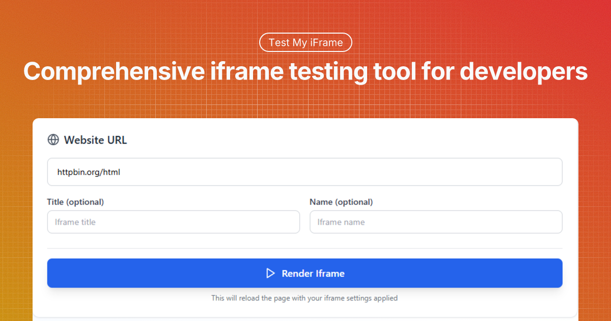

# 🖼️ Advanced Iframe Testing Application



> A comprehensive, interactive tool for testing and configuring iframe elements with real-time preview, security controls, and code generation.

[](https://reactjs.org/)
[](https://www.typescriptlang.org/)
[](https://vitejs.dev/)
[](https://tailwindcss.com/)

## 🎯 Project Overview

The **Advanced Iframe Testing Application** is a powerful, browser-based tool designed to help developers test, configure, and debug iframe implementations. Whether you're embedding third-party content, testing security policies, or optimizing iframe performance, this application provides an intuitive interface to:

- 🔧 **Configure iframe attributes** with real-time validation
- 🛡️ **Test security policies** using predefined or custom sandbox settings  
- 📱 **Preview responsive behavior** across different device dimensions
- 🔍 **Debug iframe issues** with comprehensive diagnostic information
- 📋 **Generate production-ready code** with copy-to-clipboard functionality
- 🌐 **Share configurations** via URL parameters for team collaboration

### Key Features

- **Real-time iframe preview** with loading states and error handling
- **Security-focused attribute management** with preset configurations
- **Responsive dimension testing** with device-specific presets
- **Custom attribute support** for advanced iframe configurations
- **URL parameter encoding/decoding** for shareable configurations
- **Debug panel** with detailed iframe analysis
- **Code generation** with clean, production-ready HTML output

## 🚀 Installation Instructions

### Prerequisites

- **Node.js** (version 16.0 or higher)
- **npm**, **yarn**, or **pnpm** package manager

### Step-by-Step Setup

1. **Clone the repository**
   ```bash
   git clone <repository-url>
   cd iframe-testing-app
   ```

2. **Install dependencies**
   ```bash
   npm install
   # or
   yarn install
   # or
   pnpm install
   ```

3. **Start the development server**
   ```bash
   npm run dev
   # or
   yarn dev
   # or
   pnpm dev
   ```

4. **Open your browser**
   Navigate to `http://localhost:5173` (or the port shown in your terminal)

### Build for Production

```bash
npm run build
npm run preview
```

## ⚙️ Configuration Options

The `AttributeControls` component is the heart of the iframe configuration system. Here's a detailed breakdown of all available options:

### Core Props

#### `expandAllSections` (boolean, default: `false`)
Controls whether all attribute sections are expanded by default.

**Purpose**: Enhances the iframe testing experience by providing immediate visibility into all available configuration options.

**Use Cases**:
- **Quick Overview**: When you need to see all available security and permission settings at once
- **Educational/Training**: Perfect for demonstrating iframe security concepts to team members
- **Debugging**: Rapidly identify which permissions are enabled when troubleshooting iframe issues
- **Configuration Review**: Easily audit all settings before deploying to production

**Example Usage**:
```tsx
<AttributeControls
  attributes={config.attributes}
  customAttributes={config.customAttributes}
  onAttributesChange={handleAttributesChange}
  onCustomAttributesChange={handleCustomAttributesChange}
  expandAllSections={true} // Shows all sections expanded
/>
```

**Benefits for Iframe Testing**:
- Reduces clicks needed to access configuration options
- Provides comprehensive view of security posture
- Speeds up the testing workflow
- Helps identify conflicting or redundant settings

### Attribute Groups

The application organizes iframe attributes into logical groups for better usability:

#### 🔧 General Permissions
Controls basic iframe functionality and API access:

- **`allowFullscreen`**: Enable fullscreen API for media content
- **`allowPaymentRequest`**: Allow payment processing within the iframe
- **`allowAutoplay`**: Control automatic media playback

#### 🎥 Media & Hardware Permissions  
Manages access to device capabilities:

- **`allowCamera`**: Grant camera access for video applications
- **`allowMicrophone`**: Enable microphone access for audio recording
- **`allowGeolocation`**: Allow location-based services
- **`allowClipboard`**: Enable clipboard read/write operations

#### 🛡️ Sandbox Permissions
Critical security controls for untrusted content:

- **`allowPopups`**: Control popup window creation
- **`allowScripts`**: Enable/disable JavaScript execution
- **`allowForms`**: Allow form submission capabilities
- **`allowModals`**: Control modal dialog display
- **`allowPointerLock`**: Enable pointer lock API for games
- **`allowPresentation`**: Allow presentation mode for slides/demos
- **`allowTopNavigation`**: Control navigation of parent window

## 📖 Usage Examples

### Basic Iframe Configuration

```tsx
import { AttributeControls } from './components/AttributeControls';

function IframeConfigPanel() {
  const [attributes, setAttributes] = useState({
    allowFullscreen: true,
    allowScripts: true,
    allowForms: false,
    // ... other attributes
  });

  return (
    <AttributeControls
      attributes={attributes}
      customAttributes={[]}
      onAttributesChange={setAttributes}
      onCustomAttributesChange={() => {}}
      expandAllSections={false}
    />
  );
}
```

### Security-First Configuration

```tsx
// For embedding untrusted content
const secureConfig = {
  allowFullscreen: false,
  allowScripts: false,
  allowForms: false,
  allowPopups: false,
  // All security features disabled
};

<AttributeControls
  attributes={secureConfig}
  expandAllSections={true} // Show all security options
  // ... other props
/>
```

### Media-Optimized Configuration

```tsx
// For video/media content
const mediaConfig = {
  allowFullscreen: true,
  allowAutoplay: true,
  allowScripts: true,
  allowPresentation: true,
  // Optimized for media playback
};
```

## 🔧 API Documentation

### AttributeControls Component

#### Props

| Prop | Type | Default | Description |
|------|------|---------|-------------|
| `attributes` | `IframeAttributes` | Required | Current iframe attribute configuration |
| `customAttributes` | `CustomAttribute[]` | Required | Array of custom HTML attributes |
| `onAttributesChange` | `(attributes: IframeAttributes) => void` | Required | Callback for attribute changes |
| `onCustomAttributesChange` | `(customAttributes: CustomAttribute[]) => void` | Required | Callback for custom attribute changes |
| `expandAllSections` | `boolean` | `false` | Whether to expand all sections by default |

#### IframeAttributes Interface

```typescript
interface IframeAttributes {
  allowFullscreen: boolean;
  allowPaymentRequest: boolean;
  allowAutoplay: boolean;
  allowCamera: boolean;
  allowMicrophone: boolean;
  allowGeolocation: boolean;
  allowClipboard: boolean;
  allowPopups: boolean;
  allowScripts: boolean;
  allowForms: boolean;
  allowModals: boolean;
  allowPointerLock: boolean;
  allowPresentation: boolean;
  allowTopNavigation: boolean;
}
```

#### CustomAttribute Interface

```typescript
interface CustomAttribute {
  id: string;
  name: string;
  value: string;
}
```

### Preset Configurations

The application includes four predefined attribute presets:

#### 🛡️ Secure Preset
**Use Case**: Embedding untrusted or unknown content
```typescript
{
  allowFullscreen: false,
  allowScripts: false,
  allowForms: false,
  allowPopups: false,
  // All permissions disabled for maximum security
}
```

#### ✅ Permissive Preset  
**Use Case**: Trusted content requiring maximum functionality
```typescript
{
  allowFullscreen: true,
  allowAutoplay: true,
  allowScripts: true,
  allowForms: true,
  allowPopups: true,
  allowClipboard: true,
  allowPresentation: true,
  // Most permissions enabled for compatibility
}
```

#### 🎥 Media Preset
**Use Case**: Video players, streaming content, presentations
```typescript
{
  allowFullscreen: true,
  allowAutoplay: true,
  allowScripts: true,
  allowPresentation: true,
  // Optimized for media content
}
```

#### 🔄 Interactive Preset
**Use Case**: Forms, interactive applications, user input
```typescript
{
  allowScripts: true,
  allowForms: true,
  allowModals: true,
  allowClipboard: true,
  allowPopups: true,
  // Focused on user interaction capabilities
}
```

## 🌐 URL Parameter Configuration

The application supports comprehensive URL parameter encoding for sharing configurations:

### Supported Parameters

| Parameter | Type | Description |
|-----------|------|-------------|
| `url` | string | Target iframe URL |
| `width` | number | Iframe width |
| `height` | number | Iframe height |
| `widthUnit` | 'px' \| '%' | Width unit |
| `heightUnit` | 'px' \| '%' | Height unit |
| `title` | string | Iframe title attribute |
| `name` | string | Iframe name attribute |
| `allowFullscreen` | 'true' \| 'false' | Fullscreen permission |
| `allowScripts` | 'true' \| 'false' | Script execution permission |
| `customAttrs` | JSON string | Custom attributes array |

### Example URL

```
https://your-app.com/?url=https://example.com&width=800&height=600&allowFullscreen=true&allowScripts=false
```

## 🔍 Troubleshooting

### Common Issues and Solutions

#### Iframe Not Loading
**Symptoms**: Blank iframe or loading indicator persists
**Solutions**:
1. Check if the target URL supports iframe embedding (X-Frame-Options)
2. Verify HTTPS/HTTP protocol compatibility
3. Enable `allowScripts` if the content requires JavaScript
4. Check browser console for security errors

#### Security Errors
**Symptoms**: Console errors about blocked features
**Solutions**:
1. Review sandbox permissions in the Security & Permissions section
2. Use the "Secure" preset as a starting point for untrusted content
3. Enable specific permissions incrementally
4. Check the Debug Panel for detailed security information

#### Responsive Issues
**Symptoms**: Iframe doesn't resize properly
**Solutions**:
1. Use percentage-based dimensions for responsive behavior
2. Test with different device presets (Mobile, Tablet, Desktop)
3. Verify the embedded content supports responsive design
4. Check CSS conflicts in the parent page

#### Custom Attributes Not Working
**Symptoms**: Custom HTML attributes not appearing in generated code
**Solutions**:
1. Ensure attribute names are valid HTML
2. Check for typos in attribute names and values
3. Verify the target application recognizes custom attributes
4. Use the Debug Panel to verify attribute generation

### Debug Panel Features

The Debug Panel provides comprehensive iframe analysis:

- **URL Analysis**: Protocol, hostname, and path breakdown
- **Security Summary**: Active sandbox and allow attributes
- **Dimension Info**: Current size and unit configuration
- **Custom Attributes**: List of all custom attributes
- **Generated Code**: Complete HTML output for copy/paste

## 🤝 Contributing Guidelines

We welcome contributions to improve the Advanced Iframe Testing Application!

### Getting Started

1. **Fork the repository**
2. **Create a feature branch**
   ```bash
   git checkout -b feature/your-feature-name
   ```
3. **Make your changes**
4. **Add tests** for new functionality
5. **Submit a pull request**

### Development Guidelines

- **Code Style**: Follow the existing TypeScript and React patterns
- **Testing**: Add unit tests for new components and utilities
- **Documentation**: Update README.md for new features
- **Type Safety**: Maintain strict TypeScript compliance

### Areas for Contribution

- 🔧 **New Attribute Presets**: Add domain-specific configurations
- 🎨 **UI Improvements**: Enhance user experience and accessibility
- 🧪 **Testing**: Expand test coverage and add integration tests
- 📚 **Documentation**: Improve examples and use case documentation
- 🌐 **Internationalization**: Add multi-language support

### Reporting Issues

When reporting bugs or requesting features:

1. **Use the issue template**
2. **Provide reproduction steps**
3. **Include browser and version information**
4. **Add screenshots for UI issues**

---

## 📄 License

This project is licensed under the MIT License - see the [LICENSE](LICENSE) file for details.

## 🙏 Acknowledgments

- Built with [React](https://reactjs.org/) and [TypeScript](https://www.typescriptlang.org/)
- Styled with [Tailwind CSS](https://tailwindcss.com/)
- Icons by [Lucide React](https://lucide.dev/)
- Powered by [Vite](https://vitejs.dev/)

---

## 👨‍💻 Made with ❤️ in India

This project was created with love by **Arnav**  
🌐 Website: [carnav.in](https://carnav.in)

---

**Happy iframe testing! 🚀**
